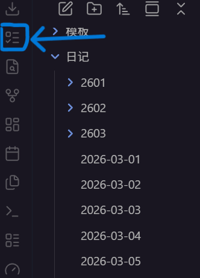

# lifeup_mod_coins

Obsidian 插件（草稿版）：在 Obsidian 日记与 LifeUp 之间同步待办（通过云人升 API）。

## 主要功能：

- 把obsidian的待办  `- [ ] ` 格式写入lifeup（手动）
- 把lifeup指定列表的任务写入obsidian的日记（自动/手动）
- 把obsidian的日记写入lifeup指定列表（自动/手动）
- 侧边栏简单查询：属性/金币/番茄数量/物品拥有数量

## 配置方法：

1. 配置好人升和云人升，获取需要的id、手机端IP（`IP:端口`，例如：`http://192.168.1.1:12345`）。详情见人升/云人升使用指南。
2. 将`\plugins` 中的文件（或压缩包里的文件）（`main.js`、`manifest.json`、`styles.css`）放置在Obsidian仓库下的 `.obsidian\plugins\Lifeup` 文件夹内。详情见obsidian插件使用指南。
3. 打开obsidian-设置-选项-第三方插件-已安装插件，刷新并启用`LifeUp ToDo Sync` 
   
4. 在设置-第三方插件-`LifeUp ToDo Sync`-连接配置 中填入手机端IP。在数据面板（下述：使用方法-1）中点击测试连接，数据正常显示则连接完成！
	1. 注意：obsidian和运行人升的手机端必须处在相同WiFi下。
	2. 再次启动obsidian时会自动连接，不必重新设置。

## 使用方法：

### 1. 数据面板：
   位于左边栏按钮。
     
   点击后会出现在右边栏。正常连接如图所示：  
     
**可以在设置中开启/关闭属性查询和物品查询。** 

### 2. 待办写入：

1). 单条写入：右键点击-写入lifeup

2). 多条写入：选中-右键点击-写入lifeup

3). 全篇日记写入：见3.日记同步

#### **注意：** 子任务规则
同步到 LifeUp 时：主任务会创建为任务，子项会创建为 subtask。已勾选子项会自动标记完成。  
多级子任务会拍平为一层并拼接路径，例如：`二级 > 三级 > 四级`。  
**LifeUp 本身只有一层 subtask。深层结构较多时会显得杂乱。因此不建议用于同步多层子任务。**


### 3. 日记同步

#### 1). Obsidian -> LifeUp

在插件设置中填写`任务清单 ID`（默认为0）、`默认任务金币奖励`（默认为0）、`日记文件夹`、`日记标题格式（正则）`、`仅同步本地今天日记`（可选）  
 **注意：日记同步模式推荐 `手动（按钮/命令）`，避免把打字中间态同步出去。**   
 手动同步按钮在这里：  
	     
或使用命令：`同步当前日记待办到 LifeUp`

#### 2). LifeUp -> Obsidian
在插件设置中填写：`启用从 LifeUp 写入日记`、 `写入触发模式`（手动/自动）、`拉取任务清单 ID`（默认为0）、`写入区块标题`  
手动同步按钮在这里：  
	  	  
或使用命令：`从 LifeUp 写入当前日记任务`

#### **写回日记区块说明：**

LifeUp 写回使用受控区块，插件会覆盖更新该区块而不是反复追加：  
```
<!-- LIFEUP_TASKS_START -->
（内容）
<!-- LIFEUP_TASKS_END -->
```
该区块会被排除出“反向推送到 LifeUp”的解析，避免循环同步。


## 贡献代码：

**不要pr，我看不懂。想要个人修改可以随意Fork。**

有增加功能的建议可以回帖或发送issue。会看，不过不一定能实现，作者能力有限。

Github仓库：[https://github.com/klienkross/lifeup_mod_coins